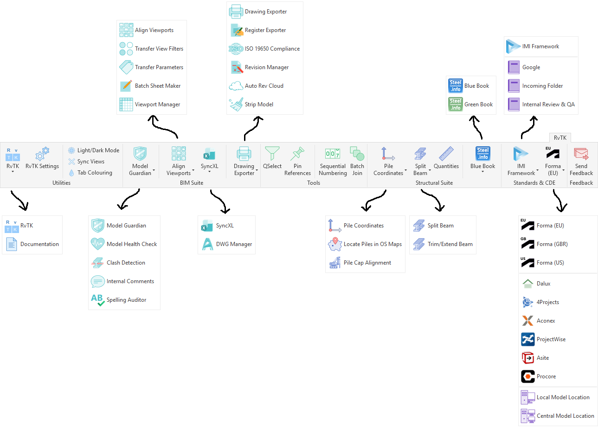

# RvTK

🚧 **Currently under active development**

### BIM Management & Productivity Toolkit for Autodesk Revit

A C# Autodesk Revit add-in focused on BIM management, quality assurance, and productivity. Developed by BIM Managers, for BIM Managers.

> **Note:** RvTK is an independent third-party add-in for Autodesk Revit. It is not affiliated with, endorsed by, or sponsored by Autodesk.
>
> **Project Status:** RvTK is currently the development name for the product and may undergo branding refinement prior to commercial release.

---

## Development Team

RvTK is being developed by a two-person team with a combined 35 years of experience across structural engineering, BIM management, and Autodesk Revit workflows.

The project has been created from real-world experience delivering BIM projects and is focused on solving practical workflow challenges encountered by Revit users.

---

## Autodesk API Integration

RvTK is developed using the Autodesk Revit API and integrates directly with Autodesk Revit functionality to automate and enhance existing workflows.

The add-in interacts with Revit elements, documents, views, sheets, parameters, and project data through the Revit API, enabling workflows including:

* Model management and quality assurance
* Drawing production and revision workflows
* Parameter management and data handling
* BIM standards and compliance workflows
* Productivity automation
* Custom user interface tools and workflow management

---

## Development Disclaimer

RvTK is currently under active development. While extensive testing and validation is carried out to improve stability and reliability, users should validate automated outputs through their normal project quality assurance processes before relying on results for project delivery.

---

## Compatibility

RvTK is developed using the Autodesk Revit API and currently supports:

* Autodesk Revit 2023
* Autodesk Revit 2024
* Autodesk Revit 2025
* Autodesk Revit 2026
* Autodesk Revit 2027 (limited testing completed)

---

## Requirements

RvTK requires:

* Windows 10/11
* Autodesk Revit 2023 or newer
* .NET Framework 4.8 or later
* A valid Autodesk Revit installation

---

# Overview

RvTK brings together the tools and workflows that BIM professionals use every day, helping reduce repetitive processes, improve consistency, and make working in Autodesk Revit more efficient.

Built from real-world project experience, RvTK focuses on practical solutions for:

* Model management
* Quality assurance
* Drawing production
* Structural workflows
* BIM standards and information delivery

The goal is to provide a unified toolkit that helps organisations improve consistency, reduce repetitive manual processes, and deliver projects more efficiently using Autodesk Revit.

---

# Screenshots



---


---

# RvTK Command Centre

The RvTK Command Centre provides a centralised location for users to access and organise their everyday Revit workflows.

The customisable **Favourites Panel** allows users to create their own personalised workspace by adding:

* RvTK tools
* Native Revit commands
* Commands from other Revit add-ins and plugins

This provides a single access point for the tools users rely on most, reducing the need to navigate through multiple ribbon tabs and interfaces.

---

# BIM Manager Configuration

RvTK includes configuration options designed for BIM Managers to manage, customise, and distribute settings across their organisation.

This allows companies to tailor RvTK to suit their own workflows, standards, and project requirements, ensuring teams have consistent access to the tools and settings they need.

Configuration options can be managed centrally and distributed to users, helping improve consistency, support BIM standards, and simplify deployment across project teams.

---

# Installation & Updates

RvTK is designed to be simple to install and update.

## Installation

1. Download the latest RvTK release package.
2. Extract the downloaded ZIP file.
3. Ensure Autodesk Revit is closed.
4. Run the RvTK installer (`.exe`).
5. Open Revit and RvTK will be available.

No additional configuration is required for a standard installation.

Administrator permissions may be required depending on your organisation's security settings.

---

## Updating RvTK

To update to the latest version:

1. Download the latest RvTK release package.
2. Close Autodesk Revit.
3. Extract the new ZIP file.
4. Run the updated RvTK installer (`.exe`).

The latest version will replace the previous installation while maintaining existing configuration settings.

---

# Uninstalling RvTK

RvTK includes a dedicated uninstaller that allows users to remove the add-in and manage stored configuration settings.

> **Note:** The RvTK uninstaller is located at:
>
> ```
> %appdata%\RvTK\RvTK uninstaller\uninstaller.exe
> ```

The uninstaller provides three options:

* **Remove Plugin Only** - Removes RvTK add-in files while keeping user configuration settings.
* **Clear Personal Configuration** - Removes user settings and preferences while keeping the RvTK installation.
* **Complete Clean Uninstall** - Removes RvTK, including add-in files, configuration files, and stored preferences.

After uninstalling, restart Autodesk Revit to ensure all RvTK components are fully removed.

---

# Evaluation Period & Feedback

During the development phase, RvTK installations include a 45-day evaluation period, allowing users to explore and test available functionality.

As development continues, evaluation access may be renewed with future releases to allow testers to continue reviewing improvements and providing feedback.

Feedback, bug reports, and feature suggestions are encouraged and can be submitted directly through the **inbuilt feedback button within RvTK**.

---

# BIM Manager Deployment

RvTK includes built-in tools to support organisation-wide deployment and configuration management.

BIM Managers can customise RvTK Settings to suit their organisation's workflows, standards, and requirements, then export the configuration package for distribution across other machines.

## Deployment Workflow

1. Configure RvTK Settings on the designated BIM Manager machine.
2. Export the RvTK configuration package.
3. Distribute the configuration package to the required users or machines.
4. Import the configuration package on each machine.

This allows organisations to maintain consistent RvTK settings across teams, helping standardise workflows, improve productivity, and support company BIM standards.

Further deployment options and management features will continue to be developed.

---

# Future Development

Future development plans include:

* Continued compatibility testing across future Autodesk Revit releases
* Expansion of BIM management and quality assurance workflows
* Additional automation tools for BIM professionals
* Enhanced organisation-wide deployment and configuration management
* Commercial licensing and support options

---

# Development & Community

RvTK is actively being developed, and feedback from users is an important part of shaping the future direction of the toolkit.

If there is a specific tool, workflow improvement, or feature that would help your team, please submit a request through the inbuilt feedback button. Suggestions will be reviewed and considered for future development.

During the development and beta testing phase, RvTK will remain available at no cost to selected testers.

As RvTK progresses towards commercial release, users will receive advance notice of any future licensing changes. Future pricing will aim to remain realistic, fair, and accessible for BIM professionals and organisations while supporting continued development and ongoing support.
