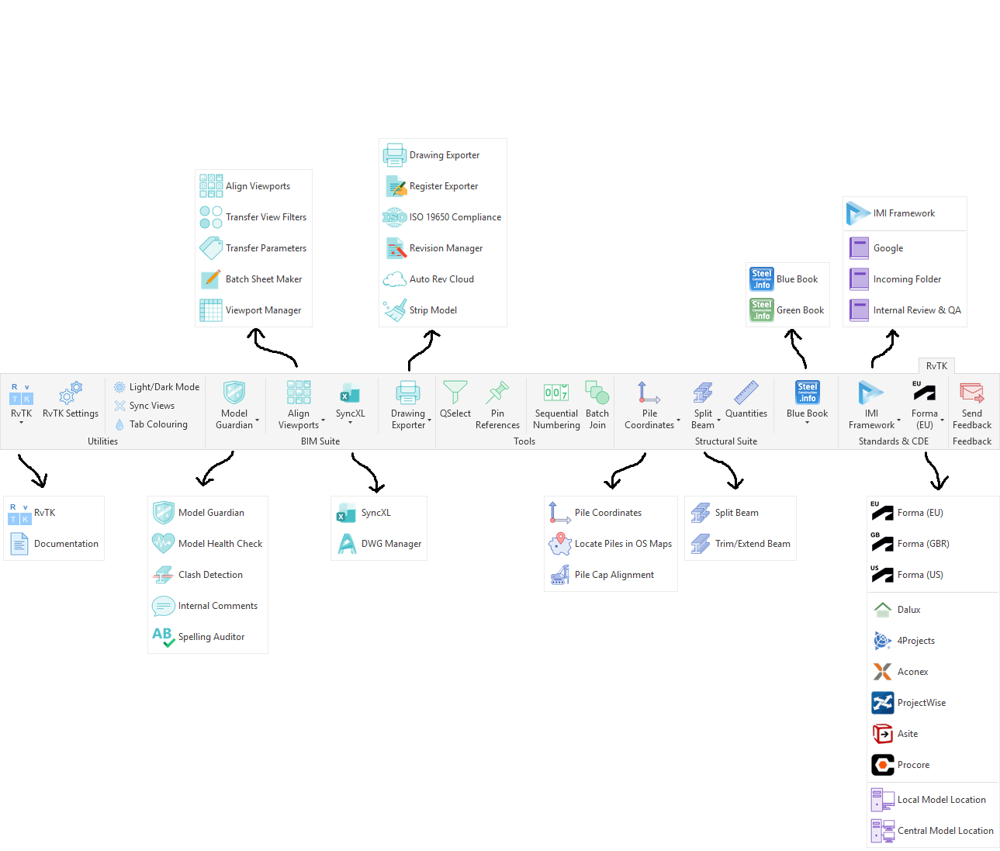

# RvTK-Releases

🚧 **Currently under active development**

**RvTK — Revit Toolkit**

A C# Autodesk Revit add-in focused on BIM management, quality assurance, and productivity. Built by BIM Managers for BIM Managers.

> **Note**: RvTK is the codename for the project and is expected to undergo rebranding prior to commercial release.

## Overview

RvTK brings together the tools and workflows that BIM professionals use every day, helping reduce repetitive tasks, improve consistency, and make working in Revit more efficient.

Built from real project experience, RvTK focuses on practical solutions for:

* Model management
* Quality assurance
* Drawing production
* Structural workflows
* BIM standards and compliance

The goal is to create a single toolkit that helps Revit users spend less time on repetitive processes and more time delivering projects.

---

---

## Trial Period & Feedback

Each installation of RvTK includes a **45-day trial period**, allowing users to explore and test the available tools.

During the development phase, the trial period will be renewed with each new patch release, ensuring users testing the latest improvements have continued access.

Feedback, bug reports, and feature suggestions are encouraged and can be submitted directly through the **inbuilt feedback button within RvTK**.

